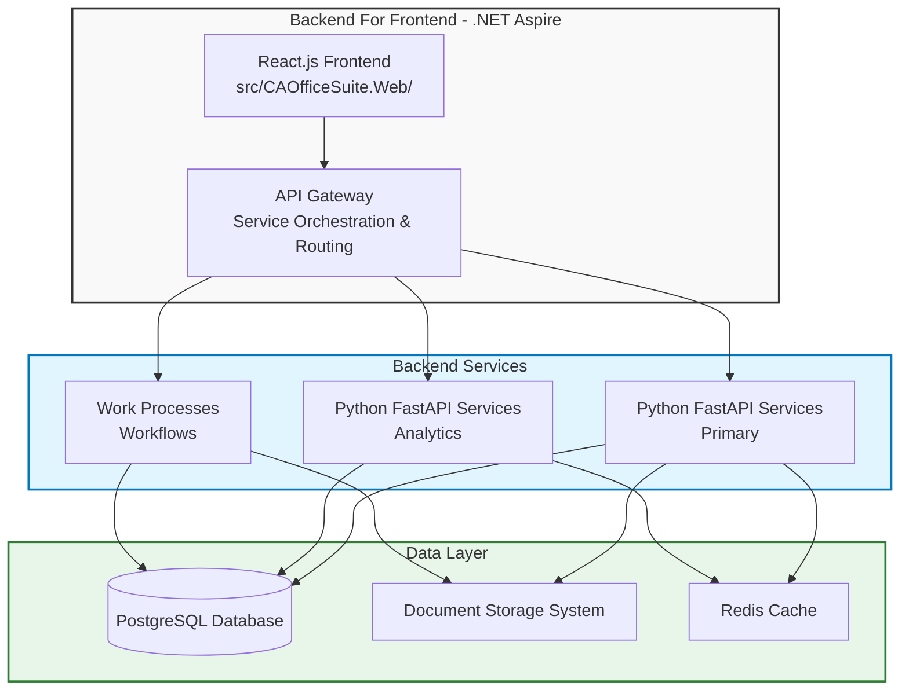

# Architecture Document

**Version**: 1.0  
**Last Updated**: December 7, 2025

---

## Architecture Overview

The application follows a **Backend For Frontend (BFF) pattern** with API Gateway orchestration:

---

## Key Architecture Decisions

- **BFF Pattern**: React.js frontend is hosted inside the .NET Aspire BFF
  - Provides a dedicated backend for the frontend application
  - Simplifies frontend-backend communication
  - Enables frontend-specific optimizations

- **API Gateway**: Centralized routing and orchestration within Aspire
  - Single entry point for all backend services
  - Request routing and load balancing
  - Authentication and authorization at gateway level
  - Rate limiting and throttling

- **Python FastAPI**: Primary backend services (preferred technology)
  - High-performance async API framework
  - Business logic services
  - Analytics and dashboard services
  - Data processing services

- **Work Processes**: Workflow engine for business process automation
  - State machine management
  - Workflow orchestration
  - Process automation and standardization

- **Heavy Dashboards**: Advanced analytics and visualization services
  - Real-time data aggregation
  - Complex query processing
  - Interactive visualizations
  - Export capabilities

---

## Architecture Layers

### 1. Presentation Layer

- **React.js Frontend** (Hosted in BFF)
  - User interface components
  - Client-side routing
  - State management
  - User interactions

### 2. BFF Layer

- **.NET Aspire BFF**
  - Hosts React.js frontend
  - Frontend-specific API endpoints
  - Request aggregation
  - Response transformation

### 3. API Gateway Layer

- **API Gateway (Inside Aspire)**
  - Service discovery
  - Request routing
  - Load balancing
  - Authentication/Authorization
  - Rate limiting

### 4. Service Layer

- **Python FastAPI Services**
  - Business logic services
  - Analytics services
  - Data processing services
  - Work process services

### 5. Data Layer

- **PostgreSQL Database**
  - Primary relational database
  - ACID compliance
  - Complex queries and transactions

- **Redis Cache**
  - Session management
  - Caching layer
  - Real-time data

- **Document Storage**
  - Secure file storage
  - Version control
  - Metadata management

---

## Communication Patterns

### Frontend to BFF

- RESTful API calls
- WebSocket for real-time updates (future)
- Server-Sent Events for notifications (future)

### BFF to API Gateway

- Internal service-to-service communication
- HTTP/HTTPS protocols
- Service discovery via Aspire

### API Gateway to Services

- RESTful API calls
- Async message queues (for long-running processes)
- Service mesh communication (future)

### Services to Data Layer

- Database connections via connection pooling
- Cache-aside pattern for Redis
- Document storage via SDK/API

---

## Scalability Considerations

- **Horizontal Scaling**: All services are stateless and can be scaled horizontally
- **Load Balancing**: API Gateway provides load balancing across service instances
- **Caching Strategy**: Multi-layer caching (Redis, in-memory, CDN for static assets)
- **Database Scaling**: Read replicas for read-heavy operations, connection pooling
- **Async Processing**: Long-running tasks handled via message queues

---

## Security Architecture

- **Authentication**: JWT tokens, OAuth 2.0
- **Authorization**: Role-based access control (RBAC) at API Gateway
- **Data Encryption**: At-rest and in-transit encryption
- **API Security**: Rate limiting, input validation, SQL injection prevention
- **Audit Logging**: Comprehensive audit trails for all operations

---

## Deployment Architecture

- **Containerization**: Docker containers for all services
- **Orchestration**: Docker Compose (development), Kubernetes (production)
- **CI/CD**: Automated build, test, and deployment pipelines
- **Monitoring**: Application insights, logging, and metrics collection
- **Health Checks**: Health check endpoints for all services

---

## Related Documents

- [Technology Stack](./03_Technology-Stack.md)
- [Requirements](./01_Requirements.md)
- [Frontend UI Requirements](./04_Frontend-UI-Requirements.md)
- [Main README](../README.md)
